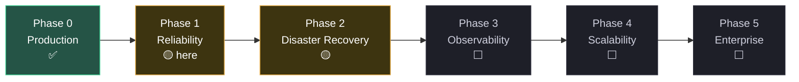

# Maturity and roadmap

A self-hosted, white-label corporate messenger. A Go backend, a vanilla-JS
front end with no build step, PostgreSQL, WebRTC calls through coturn, Web Push
and a PWA.

This document is an **honest maturity map** for technical evaluation, including
an IT department's due diligence. The technical detail lives in
`docs/ARCHITECTURE.md` (topology, ports, schema, data flows),
`docs/SECURITY.md` (security model), `docs/BACKUP.md` and `docs/RETENTION.md`.

> **The rule of this document:** *implemented*, *verified by a test*, *verified
> in production* and *needs measurement* are kept distinct. No "fully
> protected" or "ready for any load" without evidence. Every number in
> **Evidence** comes from an actual run, with its environment stated, not from
> memory.

Legend: ✅ done · 🟡 partial · ⬜ planned · 📏 needs measurement.

---

## 1. Where the project stands

A working product in production, actively going through security and
performance hardening; **reliability and scalability still need systematic
proof** through measurable tests.

```
Working product → Hardened product → [ Reliability-tested ] → Scalable → Enterprise-ready
      ✅                 ✅                   🟡 here             ⬜          ⬜
```

The path is deliberately engineering-shaped: not "enterprise some day" but
specific tasks that can be measured and closed.

---

## 2. Roadmap by maturity level



### Phase 0 — Production (✅ in place)

- ✅ Deployment: TLS, a reverse proxy, the Go application, PostgreSQL, coturn.
- ✅ Transport: WebSocket with guaranteed delivery (a persistent outbox,
  idempotency by `id`, the `seq` and `rseq` cursors).
- ✅ Features: direct and group chats, reactions, reply, edit, delete, forward,
  read receipts, typing, presence, search, files of any type, voice messages,
  link previews, profiles, WebRTC audio and video with a network test.
- ✅ Chat-list management: pin, mute, archive and "delete for me". Everything
  except pinning lives on the server (`chat_prefs`), so a phone and a computer
  agree; muting suppresses Web Push before it is sent rather than on the
  client. Actions come from a context menu: right click on a computer, long
  press on a phone.
- ✅ Security: JWT with bcrypt, encryption at rest (bodies AES-256-GCM, files
  AES-256-CTR), CSP without `unsafe-inline`, SSRF hardening, rate limiters on
  every heavy endpoint, an admin boundary (`X-Admin-Key` plus an IP filter).
  Exactly one external origin remains in the CSP (Google sign-in) — the fonts
  moved into `web/fonts`, so the client makes no third-party calls and works
  without internet access. Details in `docs/SECURITY.md`.
- ✅ Operations: `/healthz`, `/admin/metrics` (pool, uptime, goroutines,
  sockets), database and file backups with retention, CI.
- ✅ Performance work: batched message writes (×6 throughput), Postgres tuning,
  non-blocking WebSocket fan-out (lock convoy removed), the `delivered`
  batcher, and the removal of a double UNION and an N+1 in delivery
  (`docs/ARCHITECTURE.md §6`, measurements in §4).
- ✅ CI: conflict markers, `gofmt`, both builds (default and `-tags ldap`),
  `vet`, `go test -race` against a real Postgres, `node --check` over all JS.

### 🟡 Phase 1 — Reliability (priority one)

The goal is measured answers to "what happens on failure?" and "where is the
limit?".

- ✅ The load test was run against the current system from a separate machine —
  see Evidence.
- ✅ Two earlier claims — a WebSocket ceiling around 40–100 clients and poor
  reconnect behaviour — were **disproved by measurement**: both were artefacts
  of a co-located test sharing CPU and descriptors with the server. Clean runs
  give 200/200 connections, zero loss and 200/200 reconnects.
- ✅ Scale up to **1000** concurrent clients was run in steps (200/500/1000):
  1000/1000 connections, 30000/30000 acknowledged, **zero loss**, with no
  ceiling found. Repeated on an 8 vCPU VM: **1000/1000 connections,
  20000/20000 acknowledged, zero loss, connect p50 7 ms** and a 1000-client
  storm in 2.09 s. 📏 In production nothing above 500 has been tested, and that
  is a property of the machine rather than the code.
- ✅ **`/history` is optimised, with the cause established rather than
  guessed.** The bottleneck was not body decryption but the shape of the query:
  an `OR` condition produced a primary-key scan with row-by-row filtering, so
  cost followed the size of the whole table. Rewritten as a `UNION ALL` with
  `(sender,seq)` and `(recipient,seq)` indexes: worst case **110.6 → 0.5 ms
  (×215)**, common case **52.5 → 5.7 ms (×9)**. Plans and measurements in
  `docs/ARCHITECTURE.md §6`.
- ✅ **The connect path is optimised.** `peerList` runs on every WS connect and
  was the most expensive part of it: 679 blocks from disk and **148 ms** on a
  cold cache. During a mass reconnect that is 200 cold reads in a row — the
  pool stalls and connect time climbs into seconds while ACK latency stays
  healthy. The query is now index-only: **1.1 ms (×130)**.
- ⬜ `/search` remains heavy under concurrency (a scan of up to 20k rows with a
  decryption each) — the most expensive endpoint after the other work, and the
  next candidate.
- 📏 **Run hygiene:** test data accumulates from run to run and makes
  measurements incomparable, since connect cost grows with the history of the
  load-test users. Clean between series with
  `psql -f scripts/cleanup-loadtest.sql`.
- ✅ **A data race in the WebSocket hub was found and closed** (the connection
  list was edited in place while broadcasts read it without the lock).
  Confirmed by `-race` and pinned by a regression test.
- ✅ **A database outage no longer hangs senders**: `ack=failed` in 0.0 s
  instead of an unbounded wait, and pool recovery after a Postgres restart is
  down from 12.3 s to 4.1 s (`docs/ARCHITECTURE.md §10`).
- ✅ Failure drills for the **application, the proxy and PostgreSQL**: a real
  failure under traffic gave **zero loss** (60/60 in each scenario) and
  `/healthz` 200→503→200 when the database went down (`scripts/chaos-drill.py`).
  🟡 coturn: isolation is confirmed (messaging does not depend on it); stopping
  a running coturn still needs a run on the production stack.

### 🟡 Phase 2 — Disaster recovery

- ✅ 📏 **A restore drill was run**: **RTO ~6 s** (a dump of 1385 messages plus
  files into a clean database), decryption of message bodies with the current
  `SERVER_ENC_KEY` **100/100**, so the backup is usable end to end
  (`scripts/restore-drill.sh` with `hexeris verify-restore`). **RPO** ≤ the
  automatic backup interval (24 h by default).
- ✅ **Off-site copying is implemented** through `DB_BACKUP_OFFSITE_CMD` (any
  transport: rclone, rsync, S3), with paths passed through the environment. A
  failed upload does not invalidate the local backup but is visible in the log
  and in `/admin/metrics`.
  🟡 Configuring it and rehearsing end to end is the operator's step
  (`docs/DISASTER-RECOVERY.md §1.1`).
- ✅ **A disaster-recovery document** — `docs/DISASTER-RECOVERY.md`: three
  scenarios (data damage, loss of the machine, key compromise), how to verify
  backups, and a section on what remains unmeasured.
- ✅ **Backup observability** — the `backup` block in `/admin/metrics` (last
  run, age, status, off-site). Silently failing backups used to be discovered
  when they were needed.
- ✅ **A catch-up backup at startup**: the scheduler used to sleep one interval
  before its first dump, so a service restarted more often than the interval
  never backed up at all.

### ⬜ Phase 3 — Observability

- ⬜ CPU, RAM, disk and network metrics (extend `/admin/metrics` or add an
  exporter).
- ⬜ An external uptime alert on `/healthz` plus an alerting channel.
- ⬜ Error aggregation; structured logs with a request id once they prove
  useful.

### ⬜ Phase 4 — Scalability (only after a bottleneck is proven)

- ⬜ Move PostgreSQL to its own machine; benchmark the pool and the
  application's concurrency.
- ⬜ Multiple instances with shared WebSocket state (a pub/sub layer **if
  actually needed**), a load balancer, a horizontal test.
- ❌ No Redis, Kafka or Kubernetes "because enterprise" — measure the limit
  first.

### ⬜ Phase 5 — Enterprise

- ✅ **Sign-in audit** — `login_audit` plus the Sign-in Log tab (who, from
  where, outcome, method; retention bounded as for personal data).
- ⬜ SSO (OIDC/SAML), RBAC, organisation management, an audit trail of the
  remaining user actions, data retention/deletion/export, enterprise
  deployment documentation, a security questionnaire, GDPR/DPA. LDAP/AD is
  already implemented behind the `ldap` build tag.

---

## 3. Known limitations

For a technical evaluator an honest list **increases** trust.

- **A single host and a single application instance** — a complete point of
  failure; there is no horizontal scaling.
- **Latency under burst:** ACK latency grows during a synthetic spike — that is
  a queue under load, not loss. After the write optimisations it fell several
  times over: at 200 clients, ACK p50 went from 3742 to 212 ms. `/history` is
  **no longer** on this list: its cause turned out to be the query shape rather
  than decryption and has been fixed (×215 in the worst case). The heaviest
  endpoint remaining is **`/search`**, which scans up to 20k rows and decrypts
  each one.
- **Expensive connects in production are a property of the machine, not the
  code.** Established by comparison: on a local 8 vCPU VM the same code at
  **1000** concurrent clients gives connect p50 **7 ms** and a full 1000-client
  storm in 2 s, while a modest production host at 200 shows seconds and 9–23%
  timeouts. The difference comes from the network (~250 ms round trip), TLS
  handshakes, a weaker CPU and 7.7% steal time from neighbours on the
  hypervisor. **Conclusion:** it is bounded by the class of machine, and
  `DB_MAX_OPEN_CONNS` does not need raising (the pool used 25 of 50).
- **The ceiling on concurrent users.** Measured locally up to **1000**
  (1000/1000 connections, 30000/30000 messages, zero loss) with no ceiling
  found; the database pool binds before sockets do. A separate ceiling was
  found and removed in the reverse proxy: a stock `worker_connections 1024`
  with two slots per WebSocket user caps a worker at roughly 512 online, and it
  failed silently by dropping clients. **In production nothing above 500 has
  been tested.**
- **Recovery after a database restart is not instant.** `database/sql` discards
  a stale connection only when handing it to a query, so after Postgres comes
  back the pool clears gradually: measured at 4.1 s, down from 12.3 s. Beyond
  that it is bounded by `DB_CONN_MAX_IDLE_S` (`docs/ARCHITECTURE.md §10`).
- **`delivered=true` means "queued for the socket", not "the client received
  it".** Protection against loss is the `seq` cursor, not that flag
  (`docs/ARCHITECTURE.md §4.1`).
- **The offline queue is drained in portions** of 1000 per connection; the rest
  arrives in the next round or through the `seq` sync.
- **Files are reachable by link to any authenticated user** (a capability URL):
  the name is 128 bits from `crypto/rand` so guessing is impractical, but there
  is no binding to the conversation's participants, and a leaked link keeps
  working. See `docs/SECURITY.md`.
- **RTO is measured** (~6 s to restore a dump of 1385 messages plus files), and
  decryption with the key was confirmed 100/100; **RPO** ≤ the automatic backup
  interval (24 h by default). What remains: off-site copying must be configured
  and rehearsed per deployment.
- **No** enterprise SSO, RBAC, DPA or compliance certifications; no antivirus
  scanning of uploads.
- No external penetration test has been performed.

> Dispelled by measurement (previously on this list): "a WebSocket ceiling
> around 40–100" and "reconnect storms go badly" were **artefacts of method** —
> the test ran from the server itself, sharing CPU and descriptors, with too
> short an ACK window. A clean run from a separate machine gives **200/200
> connections, zero message loss and 200/200 reconnects** (see Evidence). An
> early "anomalous database load" was likewise external, a client bug since
> fixed.

---

## 4. Evidence

> Source: the load test run **from a separate machine** (`ulimit -n 65535`)
> against production, 200 users × 20 messages, `--drain 30`. Off-host so the
> generator does not compete with the server for CPU and descriptors; a
> co-located run showed the same endpoints 2–10× slower, which is a
> methodological artefact and is not used.

**WebSocket (200 concurrent clients):**

| Metric | Value |
|---|---|
| Connections established | **200/200** (no errors) |
| Messages sent / acknowledged | **4000/4000**, loss **0** |
| Throughput | **412 msg/s** (a 9.7 s delivery window) |
| Connect latency (avg/p50/p95/max) | 1811 / 1523 / 3955 / 4907 ms |
| ACK latency under burst (avg/p50/p95/p99) | 5193 / 5207 / 7699 / 8402 ms |
| **Reconnect storm** (200 at once) | **200/200 in 2.94 s** |

An ACK latency of ~5 s is the queue during a synthetic spike (4000 messages
almost simultaneously), **not loss**: all 4000 were acknowledged. Real traffic
does not look like this.

**HTTP endpoints under concurrency (200 workers × 10 rounds, avg / p95):**

| Endpoint | avg | p95 | Errors |
|---|---|---|---|
| `/history` | 3467 ms | 4844 ms | 0 |
| `/search` | 2572 ms | 4114 ms | 0 |
| `/status` | 682 ms | 994 ms | 5 |
| `/reactions` | 316 ms | 726 ms | 0 |
| `/groups` | 180 ms | 422 ms | 0 |

`/history` and `/search` were the heaviest (a full scan with a decryption per
row) and at 200 concurrent workers bound on CPU and the database pool. The rest
is fast.

**Delivery optimisations, before and after** (a separate harness):

| Metric | Before | After |
|---|---|---|
| ACK p50 | 477 ms | **227 ms** |
| ACK p95 | 734 ms | **421 ms** |
| Database pool waits | 9450 | **5403** |

**Write throughput optimisation** (`scripts/bench.sh` with the load test, on a
local Docker stack with hard resource limits — one core for the application,
one for Postgres, half a core for the proxy, the profile of an inexpensive
host).

> ⚠ These numbers are **not comparable** with the production measurements
> above: a different machine and a different method, since the generator lives
> on the same host here. Only the "before" and "after" columns are comparable
> with each other, sharing one environment.

Diagnosis: Postgres saturated at 100% CPU with the application at 30% and the
proxy at 20%; `pg_stat_statements` attributed **91% of database time** to the
row-by-row INSERT into `messages`. The bottleneck was neither the proxy nor Go.

200 clients × 100 messages, median of three runs:

| Metric | Before | Batched writes | + Postgres tuning |
|---|---|---|---|
| Throughput | 2430 msg/s | 8329 | **14490 msg/s** (×6) |
| ACK p50 | 3742 ms | 777 | **212 ms** (−94%) |
| ACK p95 | 6726 ms | 1160 | **307 ms** (−95%) |
| Database pool waits | 4588 | — | **764** |
| Loss | 0 | 0 | **0** (20000/20000) |

500 clients × 100 messages: **16447 msg/s**, 500/500 connections,
50000/50000 acknowledged, zero loss, average batch size 62 rows — batching
grows with load and costs nothing without it.

The HTTP path after the proxy tuning (50 workers, light static content, median
of three): **3152 → 5931 req/s** (+88%), p95 82 → 57 ms.

> **Measurement method (important for interpreting any number here).**
> The harness separates two things that used to be conflated: the **connection
> phase** and the **exchange phase**. Throughput is computed over the second
> only (every client connected → a simultaneous start → the last ACK). While
> the window included the connection phase, a run against production reported
> "82 msg/s" alongside an ACK p50 of 238 ms — figures that contradicted each
> other, because what was measured was connection speed rather than exchange.
> Connections are opened at a **controlled rate** (`--connect-rate`, 50/s by
> default); a simultaneous storm is a separate `--mode storm`, a stress case
> (a reconnect after a proxy restart) rather than a normal profile.
> Growth in **connect time alone**, with healthy ACK latency, means an
> expensive connect path rather than an exchange ceiling.
>
> **The verified run order.**
> ```
> ulimit -n 65535                                    # BEFORE starting python
> python3 scripts/loadtest.py --print-seed-sql -n 1000 | psql "$DATABASE_URL"
> # restart the service to reset the in-memory sign-in limiter
> python3 scripts/loadtest.py --server https://<domain> --steps 200,500,1000 \
>     -m 20 --admin-key "$ADMIN_KEY" --evidence
> ```
> The harness raises the soft descriptor limit itself but cannot raise the
> **hard** one, which `ulimit -n` sets before the process starts. Before the
> steps it runs a preflight of single connections: if even one fails, the
> problem is the path to `/ws` (the proxy's upgrade handling, the certificate,
> the URL scheme) rather than a load ceiling, and the bulk run is cancelled.
>
> ⚠️ **Intrusion prevention breaks load tests — and it shows in the numbers.**
> A load test looks exactly like an attack: hundreds of connections from one
> address. A banned address gets its packets dropped, the client kernel retries
> SYN with doubling pauses, and connect times land on the **1 / 3 / 7 / 15 /
> 31 s** grid. A measured example: a preflight of three single connections at
> **59 → 254 → 1261 ms** with no load at all, then connect p50 4.5 s (two lost
> SYNs) and p95 19.9 s (four), with the 30 s timeout falling just before the
> fifth attempt. **That measures the filter, not the server.** The harness
> recognises the signature during preflight and says so. The fix is to
> allow-list the test machine's address and restart the service; without that
> access, lower `--connect-rate` to a few per second and accept that the
> numbers stay understated.
>
> **How to read connection failures.** The exception class alone is useless;
> what matters is the `errno` the harness prints:
>
> | Error | Where to fix it |
> |---|---|
> | `errno=24 Too many open files` | the **client's** descriptor limit → `ulimit -n` |
> | `errno=111 Connection refused` | the **server or proxy**: `worker_connections`, listen backlog |
> | `errno=99` (no address available) | the client ran out of local ports → use several machines |
> | `errno=110` / `ConnectTimeout` | a queue on the server **or** dropped packets (see the grid above) |
> | `WSServerHandshakeError(HTTP 4xx)` | the application rejected the upgrade (token, origin) |
>
> ⚠️ **A pitfall with the test user pool.** The sign-in limiter counts failed
> attempts and keys on the **IP address** (five per ten minutes). A few seeded
> users with the wrong password produce five failures and block the **entire**
> pool from that machine: everyone else starts failing "for no reason" (seen as
> "944/1000 and no explanation"). The seed uses `DO UPDATE` so the passwords
> match; the harness stops the sign-in phase on the first 429 and prints the
> diagnosis. The limiter lives in process memory, so restarting the service
> clears it.

**Local VM, steps of 200/500/1000** (8 vCPU / 13.9 GB, application and
generator on one machine, no TLS).

| N | Connections | acked/sent | Loss | Throughput | connect p50/p95 | ACK p50/p95/p99 | db.wait Δ |
|---|---|---|---|---|---|---|---|
| 200 | **200/200** | 4000/4000 | **0** | 4516/s | **7 / 12 ms** | 317 / 401 / 436 ms | 0 |
| 500 | **500/500** | 10000/10000 | **0** | 3953/s | **7 / 12 ms** | 119 / 323 / 427 ms | 252 |
| 1000 | **1000/1000** | 20000/20000 | **0** | 4080/s | **7 / 11 ms** | 211 / 437 / 476 ms | 766 |

A reconnect storm of 1000 at once: **1000/1000 in 2.09 s**.
HTTP at 1000 workers: `/groups` 16 ms, `/reactions` 27 ms, `/status` 32 ms,
`/history` 69 ms, `/search` 271 ms (avg).

> **This run closes a question that had stayed open.** In production, connect
> p95 measured in seconds and 9–23% of connections did not fit inside 30 s; the
> cause could not be established, and Known Limitations said "needs a series of
> runs". Here the same code at **1000** concurrent clients gives connect
> **p50 7 ms / p95 11 ms** and a 1000-connection storm in two seconds.
>
> So **expensive connects are a property of the production machine, not the
> code**: the network to it (~250 ms round trip), TLS handshakes, a weaker CPU
> and neighbours on the hypervisor (7.7% steal). The code scales to 1000
> concurrent clients with zero loss. `DB_MAX_OPEN_CONNS` still does not need
> raising: the pool opened at most 25 of the 50 allowed, with five in use.

**Production, 200 concurrent** (from a separate VM over the internet, with
packet filtering removed and the path clean). Two consecutive runs on a warm
pool with identical configuration:

| Metric | Run 1 | Run 2 |
|---|---|---|
| Sign-in | 200/200 | 200/200 |
| Preflight (5 singles) | 65 / 251 / 240 / 251 / 240 ms — **even** | 64 / 239 / 241 / 247 / 232 ms |
| Connected | 182/200 | 154/200 |
| connect p50 / p95 | 1265 / 5384 ms | 583 / 11461 ms |
| **Message loss** | **0** (3640/3640) | **0** (3080/3080) |
| Throughput | 1448 msg/s | 1481 msg/s |
| ACK p50 / p95 | 1271 / 1618 ms | 797 / 1434 ms |
| Database pool during connect | open **50/50**, wait +139 — **exhausted** | open 28/50, wait +0 — expanding |
| Reconnect storm (200 at once) | — | **200/200 in 20.9 s** |

HTTP endpoints under concurrency (200 workers × 10 rounds, 50 at a time):

| Endpoint | avg | p95 |
|---|---|---|
| `/groups` | 83 ms | 130 ms |
| `/status` | 127 ms | 536 ms |
| `/reactions` | 139 ms | 610 ms |
| `/history` | 333 ms | 1425 ms |
| `/search` | 514 ms | 1685 ms |

**What this proves:**

- **No loss** in either run — the delivery guarantee holds in production too.
- **Filtering is gone**: the preflight is even and a storm of 200 simultaneous
  connections completes in full (200/200), which is impossible while SYNs are
  being dropped.
- **`/search` is no longer an anomaly** (1974 ms before the optimisations and
  the cleanup of accumulated test data).
- **The bottleneck is the connect path**, not the exchange: ACK latency is
  healthy while connect p95 measures in seconds and 9–23% of connections do not
  fit inside 30 s.

**What this does not prove:** the reason connects are expensive is still not
established. Two consecutive runs gave opposite pool readings (exhausted at
50/50 versus expanding at 28/50) under nearly identical conditions, while the
host showed 76–95% idle CPU — so the CPU is not saturated. Steal time of 7.7%
points at neighbours on the hypervisor. The spread between runs is comparable
to the effect itself, so it is too early to conclude: this needs a series of
runs separating the contributions (TLS handshake, establishing Postgres
connections, the work done per connect). Until then, raising
`DB_MAX_OPEN_CONNS` is premature — in one of the two runs the pool did not even
reach its ceiling.

**Scale test** (`scripts/loadtest.py --steps 200,500,1000`, local stand,
N × 30 messages).

> ⚠️ The generator runs on the same host as the server, so the absolute numbers
> are **not comparable** with the production measurements above. What matters
> here is different: zero loss at every step, and the shape of the degradation.

| N concurrent | Connections | acked/sent | Loss | Throughput | ACK p50/p95/p99 (ms) | db_pool.wait Δ |
|---|---|---|---|---|---|---|
| 200 | 200/200 | 6000/6000 | **0** | 6624/s | 15 / 162 / 218 | 413 |
| 500 | 500/500 | 15000/15000 | **0** | 6112/s | 53 / 322 / 474 | 1816 |
| 1000 | 1000/1000 | 30000/30000 | **0** | 6807/s | 97 / 397 / 651 | 3552 |

No ceiling was **found**: connections at 100%, no loss, throughput steady. What
grows is ACK latency and `db_pool.wait`, so the limiter is the **database pool**
(`DB_MAX_OPEN_CONNS=50`) rather than CPU, sockets or the WebSocket hub. After
the run (61 000 messages): `panics=0`, `fast_fails=0`, `save_timeouts=0`,
`slow_client_drops=0`, average batch size 13.0, and **goroutines returned to
13** once all 1000 clients disconnected — no goroutine leak on the
connect/disconnect path.

**Database failure drill** (the database stopped immediately under traffic):

| Check | Result |
|---|---|
| Sending with the database down | `ack=failed` in **0.0 s**, no hang |
| Senders left without an answer | **0** |
| `/healthz` with the database down | **503** immediately |
| Writes after the database returns | **3/3** recovered |
| `/healthz` 503 → 200 once the database is ready | **12.3 s → 4.1 s** (before/after the pool fix) |

> The mechanism behind the delay is established precisely: 25 dead connections
> in the pool means 25 requests, one discarded connection each. Details and the
> query plan are in `docs/ARCHITECTURE.md §10`.

**Reliability drills** (`scripts/chaos-drill.py`, a development stack in Docker
on 1 core / 1 GB RAM, N=60 messages per scenario):

| Component failure (a real failure under traffic) | Message loss | /healthz |
|---|---|---|
| Restart the application under load | **0** (60/60 acked, 60/60 received) | — |
| Restart the proxy (every socket dropped → reconnect) | **0** (60/60) | — |
| Stop and start PostgreSQL | **0** (they arrive once the database is back) | **200 → 503 → 200** ✅ |
| coturn (isolation) | **0** (messaging does not depend on it) | — |

> The guarantee mechanism (a persistent outbox, idempotency by `id` and the
> `seq` cursors) was confirmed by **actually injecting** failures: the
> application, the proxy and PostgreSQL were stopped under traffic, and all 60
> messages in each scenario arrived without duplicates or loss. **Caveat on
> coturn:** the development stack has none, so that row only demonstrates
> isolation; stopping a running coturn needs a run on the production stack.

**Recovery drill** (`scripts/restore-drill.sh` with `hexeris verify-restore`,
restoring into a scratch database and directory, production untouched):

| Metric | Value |
|---|---|
| Restored from the dump | users **20**, messages **1385**, groups **34**, reactions **127** |
| Body decryption sample (GCM, the current `SERVER_ENC_KEY`) | **100 / 100 ok, 0 fail** — the key matches the backup |
| Files restored | 102 (44 encrypted, 58 legacy or other) |
| **RTO** (loading the dump plus unpacking files) | **~6 s** (plus seconds for a service restart in a real recovery) |
| **RPO** | ≤ the automatic backup interval (`DB_BACKUP_INTERVAL_HOURS`, **24 h** by default) |

> Restorability is proven **end to end**: the dump loads into a clean database
> and bodies really do decrypt with the current key (100/100), so "backup plus
> key" is usable rather than merely "pg_dump produced a non-empty file". RTO
> was measured on production-scale data.

---

## 5. Four gate questions before a pilot

What matters is not new features but **measured** answers:

- **A. Reliability** — what happens when components fail? *(Phase 1 drills)*
- **B. Scalability** — where is the real limit of this architecture?
  *(Phase 1 investigation)*
- **C. Recovery** — can production actually be restored, and how quickly?
  *(Phase 2 restore drill)*
- **D. Security** — can the claimed level be demonstrated? *(`docs/SECURITY.md`
  plus a penetration test)*

---

## 6. Principles

- **Break nothing:** authentication, the WebSocket layer, the schema, the
  deployment configuration, TURN and the security mechanisms are not touched
  without a clear need.
- **Incrementally:** small verifiable changes in separate branches.
- **Consistency > abstraction > polish.**
- **Verifiability:** every change is backed by a build or a test, and every
  number by an actual run.
- **Do not build for infrastructure that does not exist:** no code for Redis,
  object storage or Kubernetes until a bottleneck is measured.

---

## 7. Documentation map

| Document | About |
|---|---|
| `ROADMAP.md` (this one) | Maturity, phases, known limitations, evidence |
| `docs/ARCHITECTURE.md` | Topology, ports, API, schema, data flows, failure points |
| `docs/SECURITY.md` | Headers, authorisation, SSRF, rate limits, encryption, tests |
| `docs/BACKUP.md` | Database and file backups, retention, restore procedure |
| `docs/DISASTER-RECOVERY.md` | Recovery scenarios, RTO/RPO, what remains unmeasured |
| `docs/RETENTION.md` | The retention janitor (disabled by default) |
| `docs/DEPLOY.md` | Installation, production, the admin panel host |
