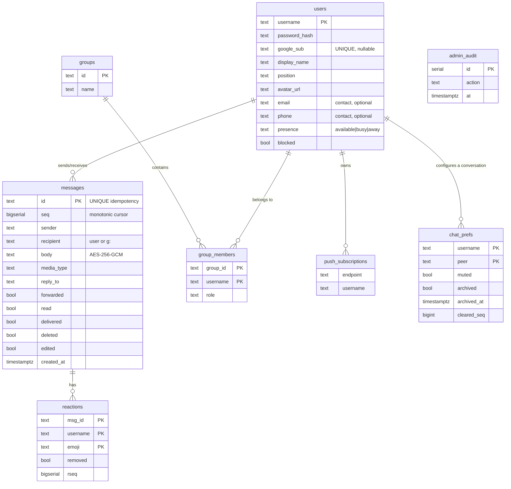

# Architecture

A technical description of the actual architecture, written for an IT
department's due diligence. The source is the repository's code
(`server/*.go`, `web/js/*`, the deployment configuration), not marketing.
Status legend: ✅ implemented · 🟡 partial · ⬜ planned · 📏 needs measurement.

## 1. Deployment topology

```mermaid
flowchart TB
    subgraph INET["Internet"]
        U["User<br/>browser / PWA"]
    end

    subgraph OPS["Operations host (optional)"]
        AWN["reverse proxy"]
        ST["/ — public status page"]
        ADM["/admin/ — panel (basic auth + IP allowlist)"]
    end

    subgraph PROD["Hexeris deployment"]
        NG["reverse proxy · TLS 443<br/>WebSocket upgrade"]
        GO["Go application<br/>TLS_MODE=http, LISTEN_ADDR=:8080"]
        PG[("PostgreSQL")]
        FS[("UPLOAD_DIR — files, encrypted at rest")]
        TURN["coturn · UDP/TCP 3478 · TLS 5349"]
    end

    U -->|HTTPS / WSS| NG
    U -->|status| AWN
    AWN -->|/api/health, +X-Admin-Key /admin/*| NG
    NG --> GO
    GO --> PG
    GO --> FS
    U -.->|WebRTC media relay| TURN
    GO -.->|TURN credentials (HMAC)| U

    classDef prod fill:#255446,stroke:#34C88A,color:#fff,font-size:15px
    classDef ops fill:#1f3a4d,stroke:#4aa3d6,color:#fff,font-size:15px
    class NG,GO,PG,FS,TURN prod
    class AWN,ST,ADM ops
```

**Operations.** The supported deployment is Docker Compose
(`docker-compose.prod.yml`): the reverse proxy terminates TLS and proxies to
the application, which speaks plain HTTP inside the network (`TLS_MODE=http`).
Running the binary directly under an init system is equally supported. Secrets
come only from the environment, and startup fails fast: without `JWT_SECRET`,
`SERVER_ENC_KEY` and `DATABASE_URL` the process refuses to start.

The admin panel on a separate operations host is optional; the messenger works
without it. Its trust boundary is described in `../operations/DEPLOY.md`.

**Front-end static files** live in `web/` (`index.html`, `manifest.json`,
`sw.js`, `LOGO_DARK.svg`, `js/`, `css/`, `assets/`), and `STATIC_DIR` must
point at them. In the container image the contents of `web/` are copied to
`/app` with `STATIC_DIR=/app`. The URLs are unchanged either way: `/js/…`,
`/css/app.css`, `/assets/…`.

## 2. Components, ports, roles

| Component | Port / address | Role | Failure → impact | Recovery |
|---|---|---|---|---|
| Reverse proxy | 443/tcp | TLS, reverse proxy, WebSocket upgrade | the whole service is unreachable | restart the proxy |
| Go application | `:8080` behind the proxy | HTTP API, WebSocket hub, encryption at rest, push | API and sockets unavailable | restart the application (graceful shutdown is implemented) |
| PostgreSQL | 5432 | persistence (users, messages, groups, reactions, subscriptions, audit) | `/healthz` → 503; history reads and writes fail; new messages are not stored | restore the database or a backup |
| coturn | 3478 udp+tcp, 5349 tls | TURN relay for WebRTC | calls fail behind NAT or a firewall (open networks may still connect peer-to-peer) | restart coturn |
| UPLOAD_DIR | host filesystem | files, encrypted (AES-256-CTR) | files unavailable | from the file backup |
| Operations host | separate machine | status page and admin panel (a stateless mirror) | no monitoring or panel; **the messenger itself is unaffected** | rebuild that host |
| The host itself | — | the whole deployment | complete outage (**single point of failure**) | restore or migrate 📏 |

## 3. HTTP and WebSocket API

Taken from `server/main.go`.

**Public / auth:** `/healthz`, `/api/config`, `/api/session-cookie`,
`/register`, `/login`, `/google-auth`, `/api/push/vapidPublicKey`.
(`/change-password` requires a token and belongs to the protected group.)

**Application (JWT):** `/ws` (WebSocket), `/history`, `/reactions`, `/search`,
`/unfurl`, `/upload`, `/files/`, `/status`, `/turn-credentials`,
`/delete-message`, `/edit-message`, `/groups*`, `/chats/prefs`, `/chats/clear`,
`/api/profile`, `/api/profiles`, `/api/presence`, `/api/push/subscribe`,
`/change-password`.

**Admin (`X-Admin-Key` plus the IP filter in `adminGuard`):** `/admin/metrics`,
`/admin/users`, `/admin/user-action`, `/admin/login-audit`, `/admin/audit`,
`/admin/groups`, `/admin/group-members`, `/admin/group-action`.

**Static:** `/`, `/manifest.json`, `/sw.js`, `/LOGO_DARK.svg`.

## 4. Key data flows

- **Authentication.** `POST /register|/login` → bcrypt check → JWT (with an
  in-memory `logoutCutoff` for forced sign-out and a `blocked` flag). Google
  sign-in verifies the identity token and binds by `google_sub`.
  `/api/session-cookie` issues the cookie that lets `` and `<video>` fetch
  `/files/` authenticated.
- **Group management.** `/groups/update` (name and description, partial
  update) and `/groups/delete` are both restricted to a group's admin.
  Disbanding broadcasts `group-changed` **before** deleting rows: after the
  `DELETE` the membership is empty and there would be nobody to notify.
  Messages survive a disbanding, exactly as they survive the last member
  leaving.
- **Adding an employee.** An administrator creates the account
  (`/admin/user-action` with `create`); the server generates a temporary
  password, returns it once and sets `must_change_password`. Signing in with
  that password leads to the change screen rather than the chat, and the flag
  is repeated in the user's own profile so a page reload cannot bypass it. A
  successful change revokes the previous tokens and immediately issues a new
  one to the current session. This is the only path that requires no directory
  on the customer's side: LDAP/AD and Google create the record on first
  sign-in, and public registration is deliberately disabled on a corporate
  instance.
- **Messages.** The client sends over `/ws?token=…`; the body is encrypted with
  **AES-256-GCM** and written to `messages` with a monotonic `seq
  (BIGSERIAL)`; a socket write marks `delivered=true` (batched, see §6); the
  client acknowledges by `id`, and a repeat creates no duplicate. The offline
  queue is `delivered=false` plus a partial index. Reactions carry their own
  cursor, `rseq`.
- **Files.** `POST /upload` (multipart, 60 MB limit) encrypts with
  **AES-256-CTR** on the way in (`[magic][IV][ciphertext]`) under a randomised
  on-disk name. `/files/` streams with Range support; **only raster images and
  video are inline**, everything else gets `Content-Disposition: attachment`
  plus `nosniff`. The real file name travels in the link's **fragment**
  (`/files/<rand>.<ext>#<name>`): browsers never send a fragment to the server,
  so URLs, disk contents and older files are untouched while the client still
  displays and saves the real name.
- **Search.** `/search` scans messages in batches and decrypts bodies in
  memory; it also matches files by comparing the query against the decoded name
  from the `#` fragment rather than the random name on disk.
- **Calls.** `/turn-credentials` issues short-lived HMAC credentials for
  coturn; signalling (`call-offer/answer/ice/end`) travels over the WebSocket
  and is never stored.
- **Push.** Web Push with VAPID; subscriptions are validated (SSRF hardening,
  see `../security/SECURITY.md`) and limited to ten per account.
- **Observability.** `/healthz` pings the database — **twice**, see §9 for why —
  answering 200 or 503. `/admin/metrics` exposes the connection pool, uptime,
  goroutines, socket counts and the message-writer counters (§9).

## 4.1 Delivery guarantees: what is actually guaranteed

This section describes measured behaviour verified by tests
(`server/delivery_test.go`) and drills, not intent.

| Claim | Status | Evidence |
|---|---|---|
| A missing ACK is not a loss | ✅ | The message is already stored as `delivered=false`; a client retry with the same `id` returns the **same** `seq` and creates no duplicate (`ON CONFLICT DO UPDATE`) — `TestIntegrationNoAckIsNotLoss` |
| A failed socket write does not consume the message | ✅ | It stays `delivered=false` until the next reconnect — `TestIntegrationPendingSurvivesFailedSocket` |
| History rebuilds through `seq` without gaps or duplicates | ✅ | 120 concurrent sends → paged catch-up returns exactly 120 with strictly increasing `seq` — `TestIntegrationSeqRecoveryNoGaps` |
| The all-conversations sync leaks nothing and loses nothing | ✅ | `TestIntegrationFullSyncScope` |
| A database outage does not hang the sender | ✅ | `ack=failed` in 0.0 s, and writes resume once the database is back (drill, §10) |

**What `delivered=true` really means:** "the frame was placed in the
connection's outbound queue", not "the client received it". That is a
deliberate trade-off: the flag serves the offline queue rather than acting as a
receipt. The real protection against loss is the `seq` cursor — a client pulls
everything newer than its cursor regardless of `delivered`. A process crash
between queueing and the actual socket write therefore loses nothing; the
message arrives through the catch-up.

**The offline queue is bounded.** One connection drains at most
`maxPendingPerConnect` (1000) messages; the remainder stays `delivered=false`
and arrives in the next round or through the ordinary `seq` sync. Without that
cap a user with a large backlog pulls every undelivered row into memory and
decrypts each one — multiplied by the number of clients during a mass
reconnect, an OOM vector.

## 5. Data model (PostgreSQL)

The schema is created idempotently from Go (`CREATE TABLE IF NOT EXISTS` plus
`ALTER … ADD COLUMN IF NOT EXISTS`); there are no separate migration files.



**Indexes as built:** `idx_messages_id` (UNIQUE), the partial
`idx_messages_recipient_pending WHERE delivered=false` (offline queue),
**`idx_messages_recipient_seq_sender(recipient,seq) INCLUDE (sender)`** and
**`idx_messages_sender_seq(sender,seq)`** — these serve both equality lookups by
recipient (the peer list on every WS connect) and paged history catch-up
(`… AND seq > $2 ORDER BY seq`) as a range scan that stops at `LIMIT` (§6).
`INCLUDE (sender)` makes the second index covering for the peer list, which
otherwise visits the heap for every row (§6). Also
`idx_messages_pair_seq(sender,recipient,seq)` (one conversation),
`idx_messages_group_seq` (groups), `idx_messages_search` (search),
`idx_reactions_msg`, `idx_reactions_rseq`, `idx_group_members_user`,
`idx_push_user`, `idx_admin_audit_created` and `idx_users_google_sub` (a unique
partial index).

**`chat_prefs`** holds one user's settings for one conversation — the pair "who
is looking" × "at which chat": mute, archive and `cleared_seq`, the personal
visibility boundary left by "delete chat". It needs no separate index: the
composite primary key `(username, peer)` serves both access patterns, a
targeted UPSERT from the UI and reading all of a user's settings at sign-in.
`archived_at` orders the archive section and is set only on the transition into
the archive — sorting archived conversations by recency is wrong, since those
are exactly the chats nobody awaits and any incoming reply would reshuffle the
section. `updated_at` will not do, as it also moves on mute.

Muted pairs are additionally kept in memory (`loadMutedCache`): the decision
whether to send a push is taken for every message to every offline group
member, and a query per check would be an N+1 per message.

> `cleared_seq` **does not delete** messages: `/history` and the offline-queue
> drain drop rows with `seq <= cleared_seq` in Go. The filter lives there rather
> than in SQL because the all-conversations branch is shaped around specific
> range scans (§6) and an extra condition risks returning it to a full table
> scan. The peer keeps the conversation, and so does an internal
> investigation: "delete for everyone" in a corporate messenger would let an
> employee erase evidence.

> The single-column `idx_messages_recipient` is dropped automatically
> (`dropIndexIfCoveredBy`): it became a prefix of `recipient_seq` and paid for
> every write while giving reads nothing. The net change is **one** additional
> index on `messages`; the measured insert cost stayed within noise (~5% across
> three runs of 20k rows) against read gains of up to 215× (§6).
>
> ⚠️ **Operational note:** the schema is created at startup with a plain
> `CREATE INDEX`, not `CONCURRENTLY`. On a large existing table the first start
> of a new version spends noticeable time building two indexes, and the table
> is locked for writes throughout. On installations with millions of messages,
> create them ahead of time:
> `CREATE INDEX CONCURRENTLY idx_messages_recipient_seq ON messages(recipient, seq);`
> (and likewise for `sender_seq`) so startup finds them ready.

**Pool:** `DB_MAX_OPEN_CONNS` (50 by default, idle = (max+1)/2),
`DB_STATEMENT_TIMEOUT_MS=10000` (a ceiling on query execution),
`DB_CONNECT_TIMEOUT_S=3` (an honest 503 when the database is down instead of a
hanging connect), `DB_CONN_MAX_IDLE_S=60` and `ConnMaxLifetime=30m`, which bound
the lifetime of idle connections and therefore determine how quickly the pool
sheds dead ones after a database restart (§10). The metric
`db_pool.wait_count > 0` is the first place to look when the server feels slow.

## 6. Performance: the optimisations that are implemented

**Write throughput.** Profiling under load showed **91% of database time** in
the row-by-row `INSERT` into `messages` — the bottleneck was neither the proxy
nor the Go code.

- **Batched message writes** (`server/msgwriter.go`): four writers pull from a
  shared queue (`msgQueueCap=4096`) and write a batch as **one multi-row
  INSERT** of up to 200 rows. Batching is **opportunistic and timer-free**: the
  first message is taken blocking, then only what is already queued is added —
  under light load a batch is one message and latency does not grow, under load
  batches enlarge themselves. Statement parsing, the transaction and the WAL
  flush are paid once per batch, roughly 6× cheaper per row. `ON CONFLICT(id)
  DO UPDATE … RETURNING` preserves idempotency, so a retry of the same `id`
  receives the same `seq`. The average batch size is visible in
  `/admin/metrics` (`avgBatchRows`): ≈1 means no load, ≫1 means batching
  engaged.
  **A failed batch is retried row by row only when a row is at fault**
  (Postgres error classes 22 and 23). On an infrastructure failure — database
  unreachable, `statement_timeout`, a closed connection — the batch is rejected
  whole: row-by-row retry would turn one outage into 200 sequential requests,
  which at a 3-second connect timeout is about ten minutes of a dead writer and
  up to half an hour at a 10-second statement timeout. With four writers stuck,
  the 4096-slot queue fills and senders hang. The counter is `fast_fails`.
- **Waits in `saveMessage` are bounded** (5 s to enqueue, 30 s for a reply).
  Blocking unconditionally meant that during a database outage the WebSocket
  handler's goroutine stalled forever: the client received neither the message
  nor an error while the connection hung dead, since the read loop cannot
  resume until `routeMessage` returns. Now the sender gets `ack=failed` and
  retries with the same `id`, which is idempotent. The counter is
  `save_timeouts`.
- **A writer panic no longer removes it from the pool.** Recovering at the
  goroutine level still ended the goroutine: the writer pool silently shrank,
  waiters on `<-reply` hung forever, and `/healthz` kept answering 200 because
  the database was alive. `safeFlush` restarts the writer and answers every
  waiter with an error. The counter is `panics`; any non-zero value is a bug.
- **Postgres tuning** for this workload, plus removing logging from the hot
  path.

**WebSocket fan-out** (removing a lock convoy):

- **Non-blocking sends** (`Client.send` → the `c.out` queue plus a single
  `writeLoop` writer). A synchronous `WriteMessage` with a 10-second deadline
  used to run under the global `mu.RLock()` held by presence, typing, reaction
  and delivery broadcasts, so one stuck receiver held that lock and with it the
  entire connect/disconnect path: the CPU idled while throughput collapsed.
  Writes are now decoupled per client, and an overflowing queue drops that
  client (`statSlowClientDrops`) without slowing the broadcast. Frame
  compression is controlled by `WS_COMPRESSION` (on by default).
- **The connection list is copy-on-write.** A disconnect rebuilds
  `clients[user]` as a new slice instead of editing in place. Broadcasts take
  the slice header under `RLock` and iterate without the lock, so in-place
  editing was a **data race** under the Go memory model: `-race` failed with
  `WRITE/PREVIOUS READ` on a slice element, and in practice it meant a skipped
  or duplicated recipient. Pinned by `TestClientsSliceNoRaceOnDisconnect`,
  which failed before the fix.
- **A closed connection rejects frames before they are queued.** The `quit`
  check used to share a `select` with the send to `c.out`: on a closed client
  both cases are ready and Go picks either with equal probability. Half the
  frames landed in the buffer of an already-stopped `writeLoop`, `send`
  returned `nil`, the message was marked `delivered=true` and fell out of the
  offline queue — a silent loss. Caught by
  `TestIntegrationPendingSurvivesFailedSocket`.

**Delivery** (fewer queries per message):

- **One query less per message:** the separate `UPDATE delivered=true` moved
  into a batcher (`server/delivery.go`, 250 ms or 500 ids), with a synchronous
  fallback on overflow. The guarantees are unchanged: `delivered` only records
  "handed to the socket", and a crash before the flush leads to re-delivery,
  which the client deduplicates by `id`.
- The heavy UNION at WS connect is computed once instead of twice;
  `deliverPending` issues one `ANY($1)` rather than N separate updates and its
  selection is bounded by `maxPendingPerConnect` (§4.1); the peer list rides an
  index instead of scanning the table.
- A broken socket is closed immediately rather than lingering in the client map.

**The connect path (`peerList`).** It runs on **every** WS connect and turned
out to cost more than everything else there. A `WHERE sender=$1 OR
recipient=$1` condition with a `CASE` made Postgres read the heap for one name:
across 4000 messages that was 679 blocks from disk and **148 ms** on a cold
cache. During a mass reconnect of 200 different users that is 200 cold reads
back to back: the pool stalls and connect time climbs into seconds while ACK
latency stays perfectly healthy (observed in production as connect p95 of 11 s
alongside an ACK p50 of 1.3 s).

The query is split into two branches, each fitting a covering index and read
**index-only**, with no heap access:

| | Before | After |
|---|---|---|
| Blocks read | 679 | **15** |
| Time (cold cache) | 148 ms | **1.1 ms** (×130) |

Equivalence of results was verified on two profiles (220 and 12 peers) with
zero divergence from the previous query.

**Reads: `/history` without a peer** (first load and every reconnect) is the
heaviest endpoint under concurrency. The cause was **not** body decryption, as
long assumed, but the shape of the query.

Before — one condition with `OR`:

```sql
WHERE (sender=$1 OR recipient=$1
   OR recipient IN (SELECT group_id FROM group_members WHERE username=$1))
  AND seq > $2  ORDER BY seq ASC  LIMIT 200
```

`EXPLAIN ANALYZE` over 300k messages showed an `Index Scan using messages_pkey`
with **row-by-row filtering**: Postgres walked the table from the cursor and
discarded other people's rows. Cost followed the size of the **whole table**
rather than the size of the answer:

| Scenario (300k messages) | Before | After |
|---|---|---|
| Reconnect by a user with nothing new (`Rows Removed by Filter: 300 426`) | **110.6 ms** | **0.5 ms** (×215) |
| Active user, first load | 52.5 ms | **5.7 ms** (×9) |
| Active user, cursor at the end (the common case) | 0.36 ms | 0.36 ms (already fast) |

After — a `UNION ALL` of independent branches, each with its own `LIMIT`. The
branches select only `seq`, and bodies are fetched in one pass over the primary
key (`WHERE seq IN (…)` also collapses a self-addressed duplicate):

```sql
SELECT … FROM messages WHERE seq IN (
  (SELECT seq FROM messages WHERE sender=$1    AND seq>$2 ORDER BY seq LIMIT $3)
  UNION ALL
  (SELECT seq FROM messages WHERE recipient=$1 AND seq>$2 ORDER BY seq LIMIT $3)
  UNION ALL
  (SELECT seq FROM messages WHERE recipient = ANY($4) AND seq>$2 ORDER BY seq LIMIT $3)
) ORDER BY seq ASC LIMIT $3
```

Two details without which the rewrite does not work:

1. **The `(sender,seq)` and `(recipient,seq)` indexes are mandatory.** On the
   older indexes the same `UNION` was *slower* than the original query (240 ms),
   because each branch still walked `messages_pkey`.
2. **The group list is resolved by a separate query** and passed as an array.
   As a subquery, `IN (SELECT …)` made the planner build a nested loop over the
   whole messages table — 116 ms even for a user in no groups at all. An empty
   list simply removes the third branch.

The query's scope (one's own direct messages in both directions plus one's own
groups, and nothing else) is pinned by `TestIntegrationFullSyncScope`.

The measured effect — **×6** write throughput, ACK p50 **−94%**, HTTP **+88%**
requests/s after the proxy tuning — is recorded in `ROADMAP.md`.

## 7. Configuration (environment)

Secrets, fail-fast: `JWT_SECRET`, `SERVER_ENC_KEY` (**critical — it encrypts
both message bodies and files; a backup without it is useless**),
`DATABASE_URL`.

Everything else: `APP_DOMAIN`, `APP_NAME`, `TURN_URLS`/`TURN_SECRET`,
`TLS_CERT`/`TLS_KEY`, `TLS_MODE` (`http` behind a proxy), `LISTEN_ADDR`,
`UPLOAD_DIR`, `STATIC_DIR`, `ADMIN_KEY`, `ADMIN_ALLOWED_IPS`, `ADMIN_ORIGIN`,
`TRUSTED_PROXY_IPS`, `GOOGLE_CLIENT_ID`, `ALLOWED_EMAIL_DOMAINS`,
`REGISTRATION_ENABLED`, `OIDC_*`, `LDAP_*`, `TOTP_ISSUER`, `VAPID_*`,
`DB_STATEMENT_TIMEOUT_MS`, `DB_MAX_OPEN_CONNS`, `DB_CONNECT_TIMEOUT_S`,
`DB_CONN_MAX_IDLE_S`, `WS_COMPRESSION`, `DB_BACKUP_*`
(see `../operations/BACKUP.md`) and the retention settings
(see `../operations/RETENTION.md`). The full list, with the command that
generates each value, is in `.env.example`.

## 8. Failure points and what has been proven

| Question | Status |
|---|---|
| A single host is a point of failure | ✅ known and documented |
| Graceful shutdown, `recover()` in background goroutines, the database pool | ✅ implemented |
| Redelivery without loss across an application restart | ✅ proven by drill: zero loss on restarting the application and the proxy under traffic (`chaos-drill.py`) |
| Behaviour when PostgreSQL fails | ✅ `/healthz` 200→503→200; messages sent during the outage arrive once the database is back; the sender receives `ack=failed` in 0.0 s and does not hang (§10) |
| Pool recovery after a database restart | ✅ measured and improved: 12.3 s → 4.1 s (§10) |
| Races on the shared WebSocket hub structures | ✅ a race on the connection list was found and closed; `go test -race` runs in CI (§6) |
| RTO/RPO | ✅ RTO ~6 s measured, RPO ≤ the automatic backup interval |
| Horizontal scaling | ⬜ single instance; multi-instance is not implemented |

## 9. Observability: what to look at during an incident

`/admin/metrics` (JSON, `X-Admin-Key` plus the IP filter). The fields that
matter:

| Field | What it tells you |
|---|---|
| `db_pool.wait_count`, `wait_duration_ms` | The pool is the main limiter under concurrency. Growing → you are at `DB_MAX_OPEN_CONNS`, not at CPU |
| `msg_writer.avg_rows` | ≈1 means there is no load (normal); ≫1 means batching engaged and is sparing the database |
| `msg_writer.queued` / `queue_cap` | The write queue. Approaching `queue_cap` → the database is not keeping up |
| `msg_writer.fast_fails` | Batches rejected because of an **infrastructure** failure. The problem is Postgres or the network, not the data |
| `msg_writer.retries` | Batches taken apart row by row — a specific row is at fault (classes 22/23) |
| `msg_writer.save_timeouts` | Senders that gave up waiting and retried. Read alongside `wait_count` |
| `msg_writer.panics` | **Always a bug.** Any non-zero value means going to the logs |
| `slow_client_drops` | Connections dropped because their outbound queue overflowed: receivers slower than the server. Distinguish from a real ceiling |
| `goroutines` | Returns to roughly 13 once every client disconnects. Growth at rest is a leak |

`/healthz` has two modes: `GET /healthz` behaves as before (`ok`/503, so
existing monitoring keeps working), while `GET /healthz?v=1` returns JSON with
a summary `status` (`ok`/`degraded`/`down`) and a per-component breakdown
(database, message writer, backup). The `X-Health-Status` header is present in
both. **200 is returned for `degraded` too**: the service answers, and a stale
backup is not an uptime incident. Alert configuration is in
`../operations/DISASTER-RECOVERY.md` §1.4.

`/healthz` pings **twice**. The first attempt may draw a stale pooled
connection, typically right after a Postgres restart, and one failure then
means an unlucky connection rather than an unreachable database. A genuine
outage fails both, so the 503 stays honest, bounded at 2×2 s.

## 10. Behaviour during a database outage and recovery (measured)

A drill on a local stand: the database was stopped immediately under traffic,
then started again.

**During the outage**, from a user's point of view:

- sending a message → `ack=failed` in **0.0 s** with the connection alive; the
  client retries with the same `id`, and the retry is idempotent;
- `/healthz` → **503** immediately, and `/admin/metrics` shows `fast_fails`
  rising;
- WebSocket handler goroutines **do not hang** (before the fixes they stalled
  permanently).

**After the database comes back**, recovery is bounded by the pool.
`database/sql` discards a stale connection only when it **hands it** to a
query, so a pool of 25 dead connections is cleared one at a time:

| | Before the fixes | After |
|---|---|---|
| `/healthz` keeps answering 503 after the database is ready | **12.3 s / 25 requests** | **4.1 s / 9 requests** |
| Message writes after recovery | resume | 3/3 recovered |

The numbers match the mechanism: 25 dead connections mean 25 requests one at a
time, and the double ping clears two per request (18/2 = 9). Beyond that,
recovery is bounded by `DB_CONN_MAX_IDLE_S` (60 s by default), after which the
background cleaner closes idle connections itself. Lowering it means faster
recovery at the cost of reconnecting to the database more often.

> This refines the earlier claim of "`/healthz` 200→503→200": the return to 200
> **did** happen, but with a delay nobody had measured, which to the eye looked
> like the service still being down.

Next steps and priorities are in `ROADMAP.md`. Security is in `../security/SECURITY.md`.
